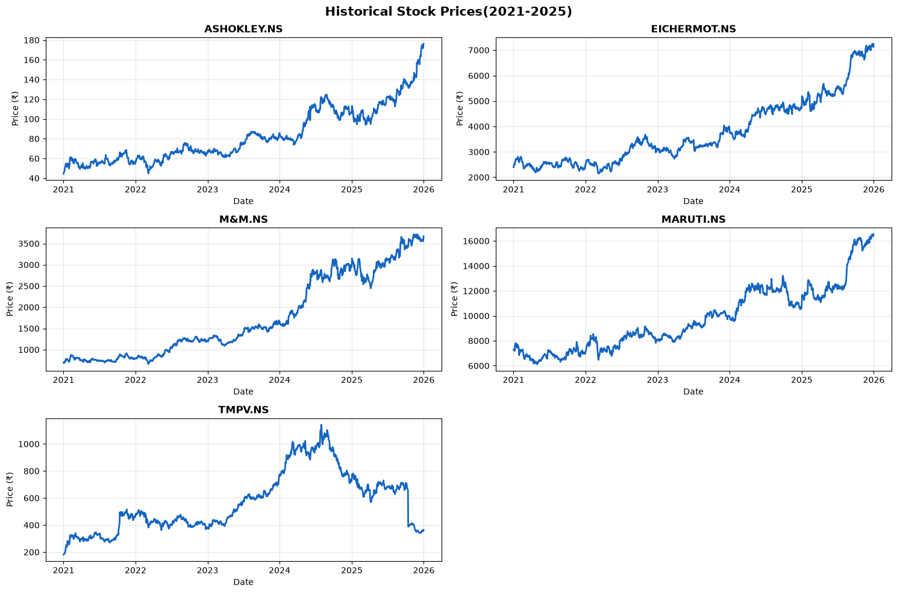
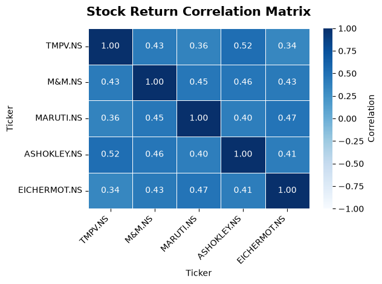
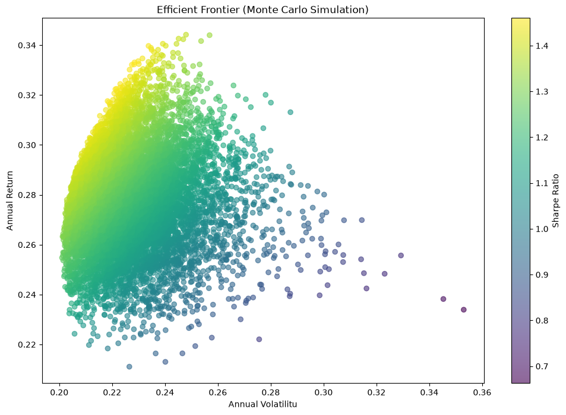
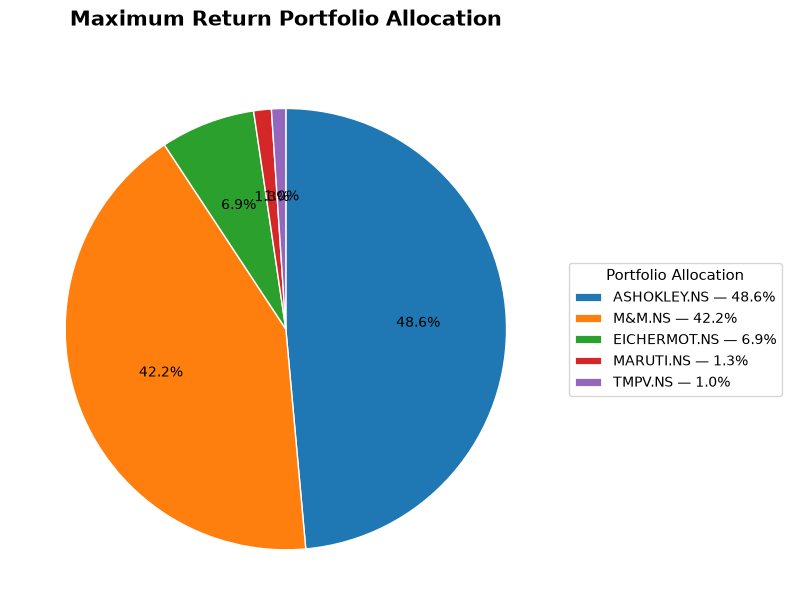
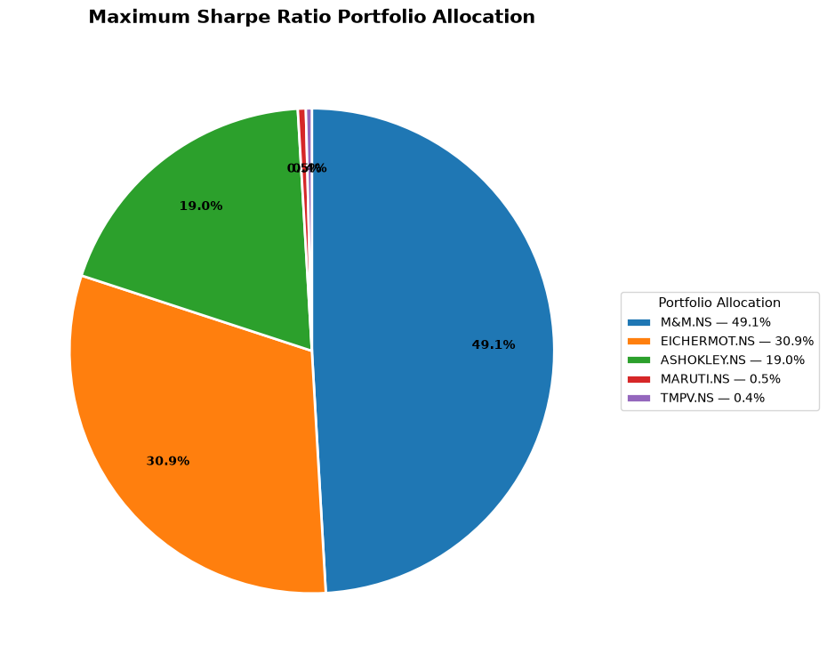
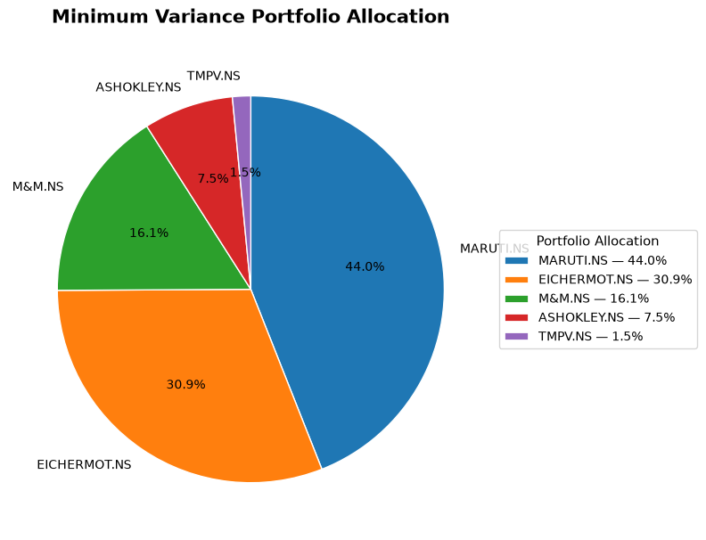
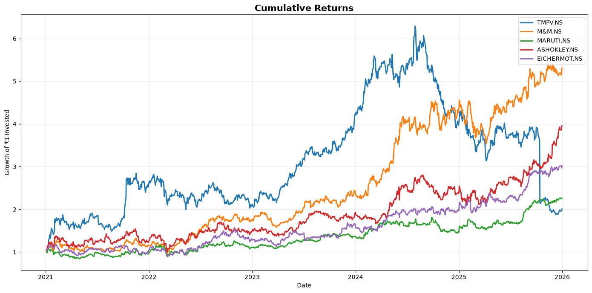
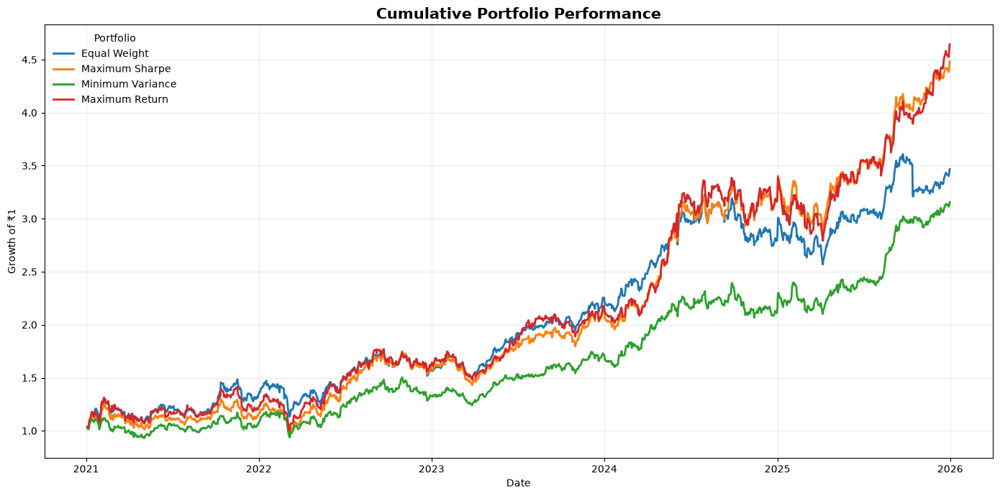
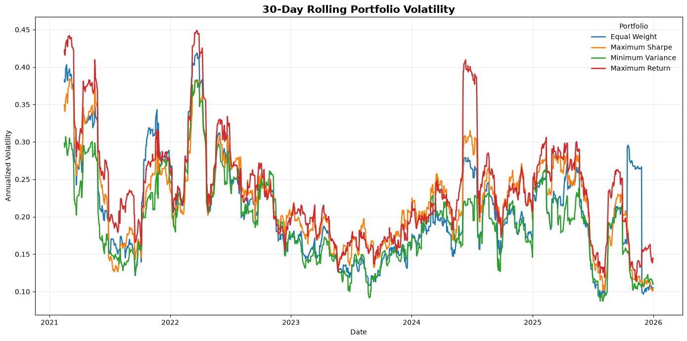

# Portfolio Optimization and Risk Analysis using Modern Portfolio Theory

## Overview

This project applies **Modern Portfolio Theory (MPT)** to construct, evaluate, and compare different stock portfolios using historical market data.

The analysis examines the relationship between portfolio **return, volatility, diversification, and risk-adjusted performance**. A Monte Carlo simulation of 10,000 randomly generated portfolios is used to identify portfolios with the highest Sharpe ratio, lowest volatility, and highest expected return.

The project also evaluates downside risk using **Maximum Drawdown, Value at Risk (VaR), and Conditional Value at Risk (CVaR)** and includes a scenario analysis and a reusable portfolio calculator.

---

## Objectives

The main objectives of the project are to:

* Analyze historical stock price and return behavior.
* Calculate individual asset returns, volatility, covariance, and correlation.
* Construct portfolios using different asset allocations.
* Simulate 10,000 randomly weighted portfolios using Monte Carlo simulation.
* Identify the Maximum Sharpe and Minimum Variance portfolios.
* Visualize the risk-return trade-off using an efficient frontier.
* Compare portfolio allocations and performance.
* Evaluate portfolio downside risk using VaR, CVaR, and Maximum Drawdown.
* Examine the effect of changing portfolio weights through a scenario analysis.
* Build a reusable portfolio calculator for evaluating user-defined allocations.

---

## Dataset

Historical adjusted closing prices were collected programmatically using **Yahoo Finance through the `yfinance` Python library**.

The analysis uses five Indian-listed automobile stocks:

* TMPV.NS
* M&M.NS
* MARUTI.NS
* ASHOKLEY.NS
* EICHERMOT.NS

The analysis is based on historical daily price observations.

---

## Methodology

### 1. Exploratory Data Analysis

The project begins by examining the historical price behavior of the selected stocks through:

* Descriptive statistics
* Historical price visualization
* Price distributions
* Boxplots
* Rolling moving averages

These steps provide an overview of the individual assets before constructing portfolios.

### 2. Return and Risk Analysis

Daily returns are calculated using percentage price changes.

The analysis then calculates:

* Mean daily returns
* Annualized returns
* Daily volatility
* Annualized volatility
* Covariance matrix
* Correlation matrix

Annualization is performed using 252 trading days.

### 3. Portfolio Construction

Portfolio-level expected return and volatility are calculated using portfolio weights, expected asset returns, and the covariance matrix.

The analysis begins with an equal-weight portfolio and then evaluates alternative allocations.

### 4. Monte Carlo Simulation

A Monte Carlo simulation generates **10,000 randomly weighted portfolios**.

For each portfolio, the analysis calculates:

* Expected annual return
* Annualized volatility
* Sharpe ratio
* Individual asset weights

The simulated portfolios are then compared to identify portfolios with different optimization objectives.

### 5. Portfolio Optimization

Three key portfolios are identified from the simulated portfolios:

* **Maximum Sharpe Portfolio** — maximizes risk-adjusted performance.
* **Minimum Variance Portfolio** — minimizes portfolio volatility.
* **Maximum Return Portfolio** — maximizes expected return within the simulated portfolios.

### 6. Efficient Frontier

The simulated portfolios are visualized using a risk-return plot.

Portfolio volatility is shown on the x-axis and expected annual return on the y-axis, with the Sharpe ratio represented through the color scale.

The Maximum Sharpe and Minimum Variance portfolios are highlighted to show their positions within the simulated portfolio set.

### 7. Portfolio Allocation

The asset weights of the Maximum Sharpe and Minimum Variance portfolios are examined through allocation tables and visualizations.

The optimized portfolios are also compared with an equal-weight portfolio to illustrate how optimization changes the allocation across assets.

### 8. Portfolio Performance Evaluation

The Equal Weight, Maximum Sharpe, and Minimum Variance portfolios are compared using:

* Expected annual return
* Annualized volatility
* Sharpe ratio

This provides a direct comparison of their return-risk characteristics.

### 9. Risk Analysis

Portfolio risk is evaluated using multiple complementary measures:

* **Annualized Volatility** — measures overall variability of returns.
* **Maximum Drawdown** — measures the largest historical peak-to-trough decline.
* **Value at Risk (VaR)** — estimates the loss threshold at the 95% confidence level.
* **Conditional Value at Risk (CVaR)** — measures the average loss beyond the VaR threshold.

Using multiple risk measures provides a broader assessment of portfolio risk than volatility alone.

### 10. Scenario Analysis

A what-if scenario examines the effect of increasing the allocation to **M&M from 20% to 40%**, while maintaining a 15% allocation to each of the remaining stocks.

The scenario is compared with the original equal-weight portfolio using:

* Expected annual return
* Annualized volatility
* Sharpe ratio

This demonstrates how changing a single portfolio allocation can alter the overall return-risk profile.

### 11. Portfolio Calculator

A reusable portfolio calculator is included to evaluate user-defined portfolio weights.

Given a set of portfolio allocations, the calculator reports:

* Expected annual return
* Annualized volatility
* Sharpe ratio

The calculator also checks that portfolio weights sum to 100%.

---

## Key Findings

The analysis demonstrates the trade-off between expected return and portfolio risk.

The simulated portfolios show that different optimization objectives produce different asset allocations. The **Maximum Sharpe portfolio** provides the strongest risk-adjusted performance among the simulated portfolios, while the **Minimum Variance portfolio** achieves the lowest estimated volatility.

The risk analysis also demonstrates why portfolio risk should not be evaluated using volatility alone. Drawdown, VaR, and CVaR provide additional information about historical losses and downside risk.

The scenario analysis further shows that changing the allocation to an individual stock can affect expected return, volatility, and risk-adjusted performance in different ways.

---

## Selected Visualizations

### Historical Stock Prices



### Correlation Matrix



### Efficient Frontier



### Portfolio Allocation

Maximum REturns Portfolio 


Maximum Sharpe Portfolio 


Minimum Variance Portfolio


### Portfolio Performance




### Portfolio Risk



---

## Technologies Used

* **Python**
* **Pandas** — data manipulation and analysis
* **NumPy** — numerical and portfolio calculations
* **Matplotlib** — data visualization
* **Seaborn** — statistical visualization
* **yfinance** — historical market data
* **Jupyter Notebook** — analysis and documentation

---

## Project Structure

```text
Portfolio-Optimization-MPT/
│
├── Portfolio_Optimization_MPT.ipynb
├── README.md
├── requirements.txt
├── .gitignore
│
└── images/
    ├── historical_stock_prices.png
    ├── 30day_moving_average.png
    ├── correlation_matrix.png
    ├── efficient_frontier.png
    ├── maximum_returns_allocation.png
    ├── maximum_sharpe_allocation.png
    ├── minimum_variance_allocation.png
    ├── portfolio_performance.png
    ├── stock_return_covariance_matrix.png
    └── 30day_rolling_portfolio_volatilityk.png
```

---

## How to Run

### 1. Clone the repository

```bash
git clone <repository-url>
cd Portfolio-Optimization-MPT
```

### 2. Install the required libraries

```bash
pip install -r requirements.txt
```

### 3. Open the notebook

```bash
jupyter notebook Portfolio_Optimization_MPT.ipynb
```

Alternatively, the notebook can be opened directly in VS Code with the Jupyter extension installed.

### 4. Run the notebook

Run the cells sequentially from data collection through portfolio optimization, risk analysis, scenario analysis, and the portfolio calculator.

---

## Limitations

* The analysis is based on historical market data and does not guarantee future performance.
* Expected returns are estimated from historical returns.
* The Monte Carlo simulation evaluates a finite set of randomly generated portfolios rather than every possible portfolio allocation.
* The Sharpe ratio calculation assumes a risk-free rate of 0%.
* The analysis does not account for transaction costs, taxes, liquidity constraints, or portfolio rebalancing.
* The risk measures are based on historical return behavior and may not fully capture future market conditions.

---

## Conclusion

This project demonstrates how Modern Portfolio Theory and quantitative risk measures can be applied to construct and evaluate investment portfolios.

By combining portfolio optimization, Monte Carlo simulation, efficient-frontier analysis, allocation analysis, and downside-risk measures, the project provides a structured framework for comparing alternative portfolio strategies and understanding the relationship between **return, risk, diversification, and risk-adjusted performance**.
